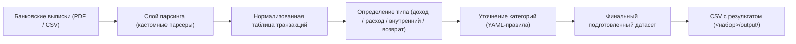
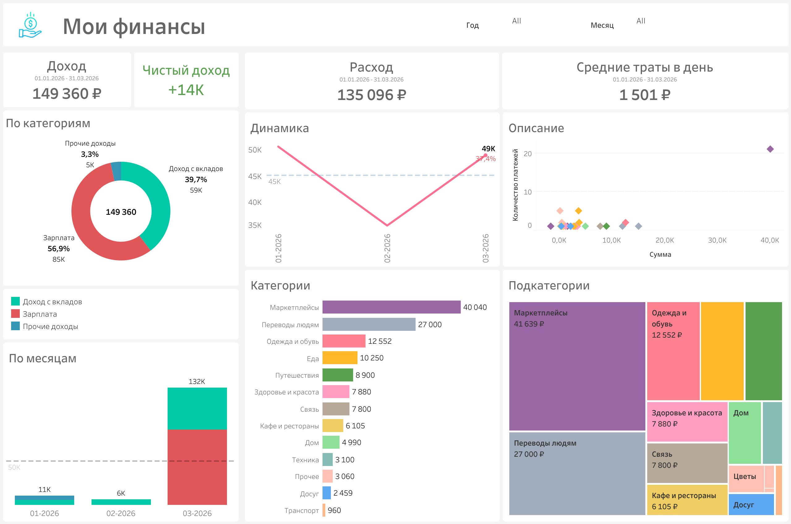
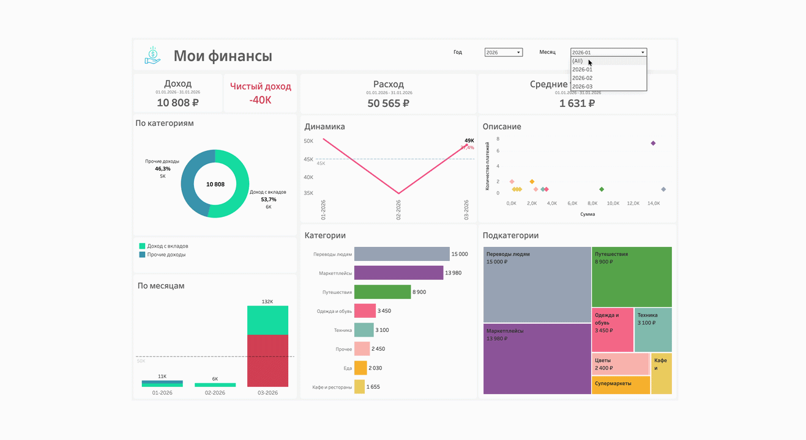
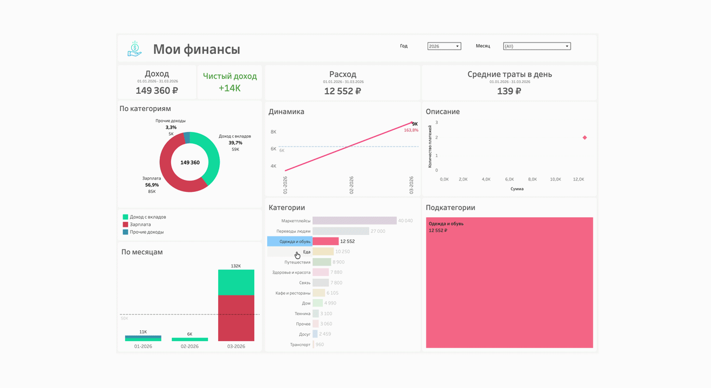
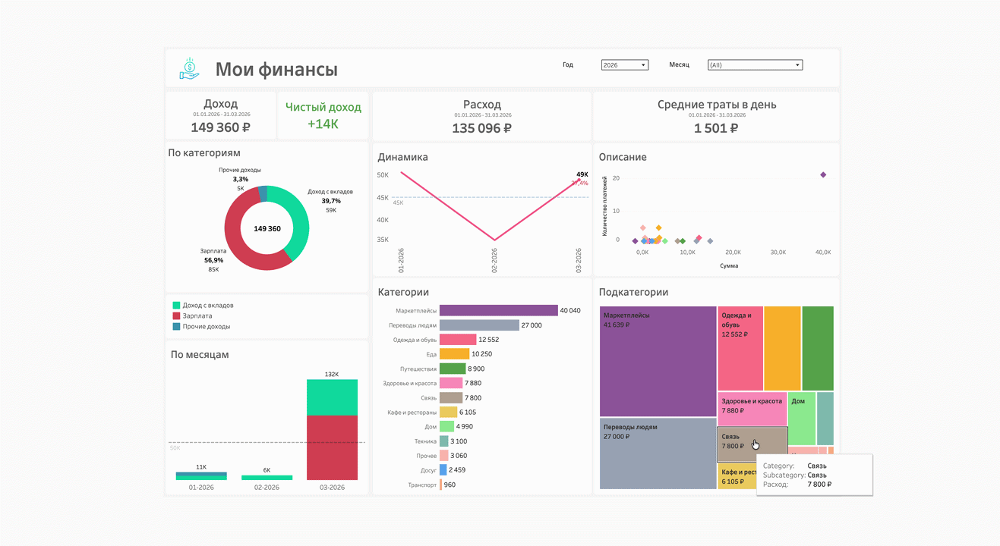

# Finance Flow

ETL-проект для личных финансов: парсит банковские выписки из нескольких источников, нормализует транзакции, определяет тип операций, уточняет категории расходов и сохраняет итоговую таблицу в CSV.

Проект вырос из реальной бытовой задачи по учёту семейных финансов и со временем превратился в переиспользуемый пайплайн обработки полуструктурированных финансовых данных.

## Зачем этот проект

- Решает прикладную задачу: собирает операции из разных банков и форматов выписок в одну чистую таблицу.
- Работает с “грязным” реальным вводом: PDF-выписки, CSV-экспорты, неоднотипные описания операций и различающиеся банковские форматы.
- Показывает полный цикл работы с данными: парсинг, очистка, обогащение по правилам и выгрузка в отчёт.

## Возможности

- Парсинг выписок из:
  - PDF по карте Сбера
  - PDF по сберегательным счетам и вкладам Сбера
  - CSV-экспортов Т-Банка
  - PDF-выписок Ozon Банка
- Определение направления и типа транзакции
- Нормализация категорий по YAML-правилам
- Фильтрация внутренних переводов между своими счетами
- Сохранение итогового датасета в CSV
- Готовый демо-набор на вымышленных данных (`demo_data/`)

## Схема пайплайна



## Структура репозитория

```text
.
├── configs/
│   ├── types.sample.yaml       # демо-правила типов под demo_data/
│   └── categories.sample.yaml  # демо-правила категорий под demo_data/
├── parsers/
│   ├── sber.py              # парсеры PDF-выписок Сбера
│   ├── tbank.py             # парсер CSV из Т-Банка
│   ├── ozon.py              # парсер PDF-выписок Ozon
│   └── utils.py             # общие regex-шаблоны и вспомогательные функции
├── pipeline/
│   ├── parsing.py           # обход папки и маршрутизация файлов
│   ├── typification.py      # определение типа операции и возвратов
│   ├── categorization.py    # присвоение категорий по правилам
│   ├── logger.py            # настройка логирования
│   └── utils.py             # нормализация текста и загрузка YAML
├── demo_data/               # вымышленный набор для демо
│   ├── input/               # игрушечные выписки
│   └── output/              # результат демо-прогона
├── data/                    # реальные данные (в .gitignore): input/ + output/
├── run_pipeline.py          # CLI-точка входа
└── requirements.txt
```

Реальные `configs/types.yaml` / `configs/categories.yaml` содержат личные правила и в git не попадают.

## Как работает проект

### 1. Парсинг

Проект обходит папку с выписками, определяет источник по расширению файла и префиксу имени, а затем передаёт файл в нужный парсер.

Основные точки входа:

- [`pipeline/parsing.py`](pipeline/parsing.py)
- [`parsers/__init__.py`](parsers/__init__.py)

### 2. Нормализация и обогащение

После парсинга все операции приводятся к единой схеме:

- `source`
- `date`
- `direction`
- `raw_amount`
- `raw_category`
- `raw_description`

Дальше пайплайн:

- определяет тип операции (`доход`, `расход`, `внутренний`, `возврат`)
- уточняет категории на основе YAML-правил
- удаляет переводы между собственными счетами

Ключевая логика:

- [`pipeline/typification.py`](pipeline/typification.py)
- [`pipeline/categorization.py`](pipeline/categorization.py)

### 3. Выгрузка

Финальный очищенный датасет сохраняется в CSV рядом с входными данными — в `<набор>/output/` с датой и временем в имени файла. Дальше его удобно подхватывать в BI-инструментах (например, в Tableau).

- [`run_pipeline.py`](run_pipeline.py)

## Дашборд

Итоговый датасет визуализируется в Tableau. Дашборд собран на вымышленном наборе `demo_data/`.

🔗 **Интерактивная версия:** [Finance Flow на Tableau Public](https://public.tableau.com/views/FinanceFlowdemo/sheet0)



**Интерактив** — фильтры по году/месяцу и drill-down по категориям:

*Фильтрация по месяцу:*



*Drill-down: клик по категории фильтрует весь дашборд:*



*Детализация по выбранной категории:*



> Сам файл `.twbx` в репозиторий не коммитится (содержит экстракт данных) — он остаётся локально, а в портфолио ведёт ссылка на Tableau Public.

## Стек

- Python
- pandas
- pdfplumber
- PyYAML
- Tableau

## Локальный запуск

### 1. Создать окружение

```bash
python3 -m venv .venv
source .venv/bin/activate
pip install -r requirements.txt
```

### 2. Подготовить входные данные

Положите выписки в папку `data/input/`.

Сейчас поддерживаются такие шаблоны имён:

- `sber*.pdf`
- `tbank*.csv`
- `ozon*.pdf`

### 3. Подготовить конфиги

Реальные `configs/types.yaml` и `configs/categories.yaml` лежат вне git. В качестве отправной точки возьмите демо-конфиги и отредактируйте их под свои банки и категории:

```bash
cp configs/types.sample.yaml configs/types.yaml
cp configs/categories.sample.yaml configs/categories.yaml
```

А для прогона на демо-данных конфиги уже готовы — `configs/types.sample.yaml` и `configs/categories.sample.yaml`, копировать ничего не нужно.

### 4. Запустить пайплайн

Запуск из командной строки:

```bash
python run_pipeline.py
```

По умолчанию результат сохранится рядом с входными данными — в `data/output/` с датой и временем в имени файла, например `transactions_2026-04-30_14-25-10.csv`. Каждый датасет самодостаточен: `<папка>/input/` для выписок, `<папка>/output/` для результата.

Готовый пример на вымышленных данных лежит в `demo_data/`:

```bash
python run_pipeline.py --data-dir demo_data \
  --types-config configs/types.sample.yaml \
  --categories-config configs/categories.sample.yaml
```

## Что показывает этот проект

- Разработку кастомных парсеров для полуструктурированных документов
- Проектирование слоя нормализации для неоднородных источников данных
- Правила категоризации и контроля качества данных
- Автоматизацию рутинной личной аналитики
- Интеграцию Python-пайплайна с инструментами отчётности

## Приватность

Репозиторий подготовлен для публичного GitHub-портфолио. Реальные банковские выписки, Excel-файлы и ключи доступа не должны попадать в git. Папка `data/` (входные данные и выгрузки) и личные `configs/*.yaml` целиком исключены через `.gitignore`; в git попадают только вымышленный набор `demo_data/`, и демо-конфиги `configs/*.sample.yaml`.
